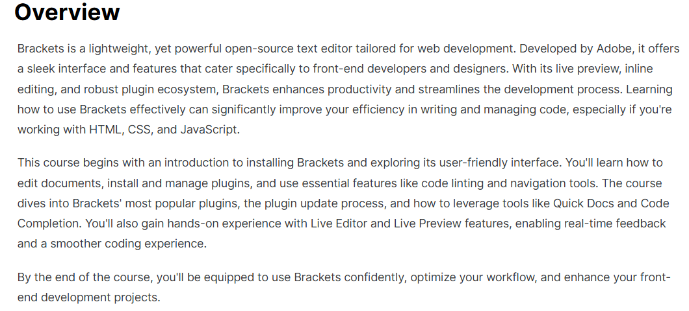
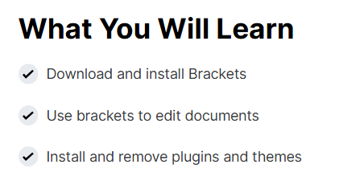
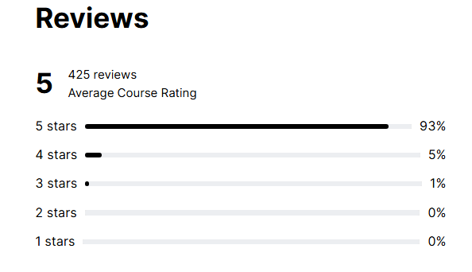

# 📝 Learn Brackets – The Open Source Text Editor (EC-Council)

This repository contains **notes, learning guides, extras, and certificate of completion** for the *Learn Brackets – The Open Source Text Editor* program by EC-Council.  
The course explores how to set up and use Brackets for modern web development, including **HTML/CSS workflows, JavaScript integration, debugging, extensions, and best practices**.

---

## 📚 Notes
- 📄 [01-introduction.md](./notes/01-introduction.md) – Introduction to Brackets
- 📄 [02-installation-and-setup.md](./notes/02-installation-and-setup.md) – Installation & setup guide
- 📄 [03-features-overview.md](./notes/03-features-overview.md) – Key features overview
- 📄 [04-extensions-and-customization.md](./notes/04-extensions-and-customization.md) – Extensions & customization
- 📄 [05-debugging-and-workflows.md](./notes/05-debugging-and-workflows.md) – Debugging & workflow practices
- 📄 [06-best-practices.md](./notes/06-best-practices.md) – Best practices for effective coding

---

## 📖 Docs
- 📘 [docs/index.md](./docs/index.md) – Course overview
- 📘 [docs/syllabus.md](./docs/syllabus.md) – Course syllabus
- 📘 [docs/roadmap.md](./docs/roadmap.md) – Learning roadmap
- 📘 [docs/glossary.md](./docs/glossary.md) – Glossary of terms
- 📘 [docs/references.md](./docs/references.md) – References & external sources
- 📘 [extras/resources.md](./extras/resources.md) – Additional resources

---

## 🧩 Learn Guides
- 🚀 [learn/getting-started.md](./learn/getting-started.md) – Getting started with Brackets
- 🎨 [learn/html-css-workflow.md](./learn/html-css-workflow.md) – HTML & CSS workflow
- ⚡ [learn/javascript-integration.md](./learn/javascript-integration.md) – JavaScript integration
- 🧩 [learn/extension-usage.md](./learn/extension-usage.md) – Using extensions
- 🛠️ [learn/advanced-tips.md](./learn/advanced-tips.md) – Advanced tips & productivity hacks

---

## 🔬 Extras
- 📑 [extras/case-studies.md](./extras/case-studies.md) – Case studies & insights
- 📆 [extras/timeline.md](./extras/timeline.md) – Timeline of Brackets development
- 📘 [extras/resources.md](./extras/resources.md) – Useful resources

---

## 📸 Screenshots

| Step | Screenshot |
|------|------------|
| 📖 Course Overview |  |
| 🖥️ What You Will Learn |  |
| ⭐ Review Page |  |

---

## 📜 Certificate
🎓 [Learn Brackets – The Open Source Text Editor](./cert/Learn%20Brackets%20-%20The%20Open%20Source%20Text%20Editor.png)

---

## 📝 Personal Review
This course provided a solid foundation in using **Brackets as an open-source editor** for web development.  
I especially valued the **live preview, inline editing, and extension ecosystem**, which make coding more efficient.  
It’s a lightweight but powerful tool, and this program covered everything from **basic setup to advanced workflows**.

---

## ✍️ Author
**Thành Danh** – Red Team Learner & Security Researcher  

- GitHub: [@ngvuthdanhh](https://github.com/ngvuthdanhh)  
- Email: ngvu.thdanh@gmail.com  

---

## 📄 License
This project is licensed under the terms of the **MIT License**. See [LICENSE](./LICENSE) for full details.  
© 2025 ngvuthdanhh. All rights reserved.
